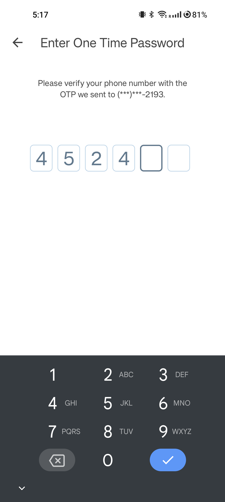
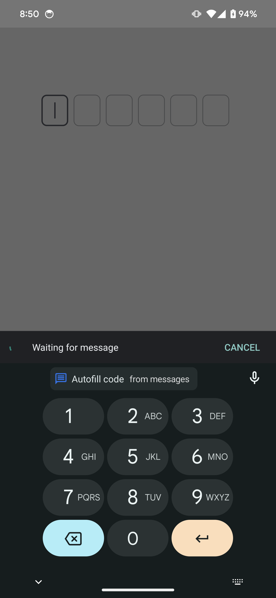

## OTP Verification with Jetpack Compose

This repository contains a custom-built OTP (One Time Password) Input Field and integration with [Google's SMS Retriever API](https://developers.google.com/identity/sms-retriever/overview)
for OTP fetch and populate functionality, developed using Jetpack Compose. This component is designed to cater to the needs
of modern Android applications requiring OTP verification, offering a blend of customization and ease-of-use.


> This is not a library. This is a demo project to experiment and try out a functionality.

### Screenshots

<table style="width:100%">
  <tr>
    <th>OTP Verification</th>
    <th>OTP Screen UI</th>
  </tr>
  <tr>
    <td></td>
    <td></td>
  </tr>
</table>

### Features
- Integration with [Google's SMS Retriever API](https://developers.google.com/identity/sms-retriever/overview) to auto verify OTP and populate.
- OTP input field can be set up for any length of OTP.
- Supports automatic filling of the OTP, a convenient feature for OTPs received from servers or other sources.
- Offers options to show a cursor, and control its blinking, enhancing the user experience.

### Note on AutoFill

> Right now Jetpack Compose does not have a good support for [Autofill](https://developer.android.com/guide/topics/text/autofill). 
> There has been some temporary solutions like [ExplicitAutofillTypesDemo.kt](https://cs.android.com/androidx/platform/frameworks/support/+/androidx-main:compose/ui/ui/integration-tests/ui-demos/src/main/java/androidx/compose/ui/demos/autofill/ExplicitAutofillTypesDemo.kt).
> Google is working to add support and we may have it in future. Autofill will benefit to fill fields from IME directly.
> 
> Issues for this feature: 
> https://issuetracker.google.com/issues/268596603
> https://issuetracker.google.com/issues/265911809
> https://issuetracker.google.com/issues/176949051

I did some experiment with the temporary solution and looks like this.
But it does not work smoothly and has many issues:

<table style="width:100%">
  <tr>
    <th>Compose Autofill</th>
  </tr>
  <tr>
    <td></td>
  </tr>
</table>


### Find this project useful ? ❤️

- Support it by clicking the ⭐️ button on the upper right of this page. ✌️

### License

```
MIT License

Copyright (c) 2024 Pushpal Roy

Permission is hereby granted, free of charge, to any person obtaining a 
copy of this software and associated documentation files (the "Software"), 
to deal in the Software without restriction, including without limitation 
the rights to use, copy, modify, merge, publish, distribute, sublicense, 
and/or sell copies of the Software, and to permit persons to whom the 
Software is furnished to do so, subject to the following conditions:

The above copyright notice and this permission notice shall be included 
in all copies or substantial portions of the Software.

THE SOFTWARE IS PROVIDED "AS IS", WITHOUT WARRANTY OF ANY KIND, EXPRESS OR 
IMPLIED, INCLUDING BUT NOT LIMITED TO THE WARRANTIES OF MERCHANTABILITY, 
FITNESS FOR A PARTICULAR PURPOSE AND NONINFRINGEMENT. IN NO EVENT SHALL THE 
AUTHORS OR COPYRIGHT HOLDERS BE LIABLE FOR ANY CLAIM, DAMAGES OR OTHER LIABILITY, 
WHETHER IN AN ACTION OF CONTRACT, TORT OR OTHERWISE, ARISING FROM, OUT OF OR IN 
CONNECTION WITH THE SOFTWARE OR THE USE OR OTHER DEALINGS IN THE SOFTWARE.
```